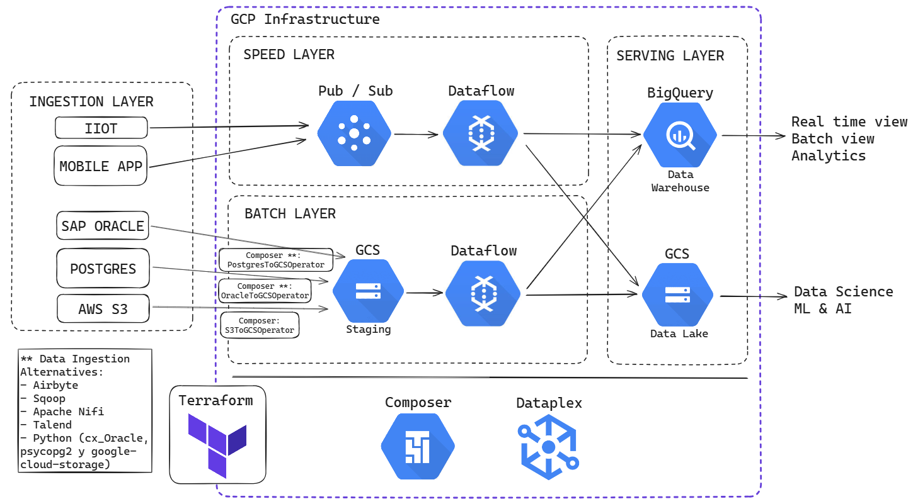

# Ejercicio de arquitectura

Te acaban de contratar en una empresa de la industria minera como Data Engineer/Data Architect para delinear su arquitectura y sugerir qué herramientas deberían utilizar para ingestar la data, procesar la información, almacenarla en un datawarehouse, orquestar y realizar Dashboards que ayuden a la toma de decisiones basadas en datos.

Luego de realizar algunas reuniones con el team de analítica de la empresa pudimos relevar:

- **Sistema ERP:** SAP con una base de datos Oracle
- **Sistema de Producción:** App desarrollada "in house" con una base de datos Postgres.
- **Fuentes externas:** un proveedor que realiza algunas mediciones de la calidad de las rocas le deja todos sus análisis en un bucket de AWS S3 con archivos Avro.
- **Mediciones en tiempo real:** Utilizan +100 sensores de mediciones de vibración por toda la mina para detectar movimiento del suelo y se podrían utilizar para predecir posibles derrumbes.
- **Apps Mobile:** La empresa cuenta con una app mobile donde trackean todos los issues pendientes con maquinaria de la mina.

# Ejercicio de arquitectura

Desarrollar una arquitectura, que sea escalable, robusta, que sea orquestada automáticamente, que contemple seguridad, calidad, linaje del dato, que sea utilizada para procesar tanto información batch como información en tiempo real.

Responder las siguientes preguntas:

1. ¿Utilizarían infraestructura on premise o en la nube?
2. ¿ETL o ELT? ¿Por qué?
3. ¿Qué herramienta/s utilizarían para ETL/ELT?
4. ¿Qué herramienta/s utilizarían para ingestar estos datos?
5. ¿Qué herramienta/s utilizarían para almacenar estos datos?
6. ¿Cómo guardarán la información, OLTP o OLAP?
7. ¿Qué herramienta/s utilizarían para Data Governance?
8. ¿Data Warehouse, Data Lake o Lake House?
9. ¿Qué tipo de información gestionarán, estructurada, semi estructurada, no estructurada?
10. ¿Con qué herramienta podrían desplegar toda la infraestructura de datos?

# Resolución 

**1. ¿Utilizarían infraestructura on premise o en la nube?**

En primera instancia, se evaluaría la infraestructura actual de la empresa y las políticas establecidas para alinear el flujo de trabajo con la infraestructura existente. 

Sin embargo, si se tiene la libertad de elegir, recomendaría utilizar una **infraestructura en la nube** por las siguientes razones:

**Escalabilidad y mantenimiento:** La nube permite escalar la infraestructura de forma rápida y sencilla para adaptarse a las necesidades cambiantes de almacenamiento y procesamiento de datos. 

El proveedor de la nube se encarga del mantenimiento de la infraestructura, liberando tiempo y recursos para enfocarse en el know how del negocio.

Además no tenemos que 

**Integración de herramientas:** La nube ofrece una amplia gama de herramientas pre-configuradas y listas para usar, lo que reduce el tiempo y esfuerzo dedicados a la configuración y gestión de herramientas para ingesta, transformación y carga de datos.

**Resiliencia de datos:** La nube proporciona redundancia y mecanismos de recuperación ante desastres para garantizar la disponibilidad y seguridad de los datos.

**Costos reducidos:** El modelo de pago por uso de la nube permite optimizar los gastos, pagando solo por los recursos que se utilizan.

**Seguridad:** La nube ofrece mejor protección que en on premise. 

### Enfoque de procesamiento de datos

**2. ¿ETL o ELT? ¿Por qué?**

Se implementará una **arquitectura Lambda** que combina una capa de **Streaming** y una capa de **Batch** para procesar y analizar datos de manera eficiente.

**Capa de Streaming:**

En la capa de Streaming se utilizará el enfoque **ELT (Extract, Load, Transform)** para ingerir **mediciones en tiempo real** y **mensajes de la aplicación móvil** por las siguientes razones:

* **Velocidad de acceso a la información:** La arquitectura ELT permite una ingesta y almacenamiento rápidos de datos sin transformaciones previas, garantizando un acceso inmediato a la información crítica, como lecturas de sensores de vibración y mensajes de incidencias.

* **Complejidad reducida:** Al evitar pipelines y transformaciones complejas en la ingesta inicial, ELT simplifica el acceso a los datos, especialmente para datos en tiempo real que requieren una respuesta inmediata.

**Capa de Batch:**

En la capa de Batch se utilizará ELT para ingerir datos del **sistema ERP**, **sistemas de producción** y **fuentes externas** y almacenarlos en un **Data Lake**. Este Data Lake servirá como repositorio centralizado de datos sin procesar, permitiendo su posterior utilización para:

* **Modelos de Machine Learning (ML) e Inteligencia Artificial (AI):** Los datos sin procesar en el Data Lake pueden ser utilizados para entrenar y desarrollar modelos de ML y AI que aporten valor a la organización.

* **Transformación y almacenamiento en un Data Warehouse (DW) para análisis:** Los datos del Data Lake pueden transformarse y almacenarse en un DW para su análisis y consulta posterior, permitiendo a los usuarios realizar análisis complejos y obtener insights valiosos.

### Herramientas

**3. ¿Qué herramienta/s utilizarían para ETL/ELT?**

* **Capa de Streaming:** Dataflow.
* **Capa de Batch:** PySpark en un clúster de Dataproc.

**Orquestación:** Composer

**4. ¿Qué herramienta/s utilizarían para ingestar estos datos?**

* **Capa de Streaming:** Pub/Sub.
* **Capa de Batch:**
    * Dataproc con Sqoop para la ingesta de bases de datos del ERP.
    * Dataproc con Sqoop para la ingesta de bases de datos de los sistemas de producción.
    * Gsutil para la ingesta desde AWS S3.

**5. ¿Qué herramienta/s utilizarían para almacenar estos datos?**

* Data Lake: Google Cloud Storage. 
* Data Warehouse: BigQuery

**6. ¿Cómo guardarán la información, OLTP o OLAP?**

**OLAP (On-Line Analytical Processing)** será la forma de almacenar la información de manera desnormalizada, ya que se utilizará para la inteligencia empresarial y la toma de decisiones. 

**7. ¿Qué herramienta/s utilizarían para Data Governance?**

Google Cloud Data Plex.

**8. ¿Data Warehouse, Data Lake o Lake House?**

Lake House. En primera se almacenan los datos desde las distintas fuentes en Google Cloud Storage, luego en Dataproc se realizan las transformaciones y finalmente se almacena la información en BigQuery. 

**9. ¿Qué tipo de información gestionarán, estructurada, semi estructurada, no estructurada?**

Se gestionará:

**Data estructurada:** Los datos provenientes del sistema ERP, el sistema de producción y fuentes externas. 

**Data semi estructurada:** Los datos provenientes de las mediciones en tiempo real y de las apps mobile, ambas (JSON).

**10. ¿Con qué herramienta podrían desplegar toda la infraestructura de datos?**

Se puede despelagar toda la infraestructura de datos con Terraform, Terraform es una herramienta de infraestructura como código (IaC), que permite definir, provisionar y gestionar la infraestructura de forma declarativa. 

Un ejemplo de como se podría realizar la estructura ETL con Terraform: 

```
resource "google_storage_bucket" "data_lake" {
  name     = "my-data-lake"
  location = "US"
}

resource "google_pubsub_topic" "iot_data" {
  name = "iot-data-topic"
}

resource "google_cloud_dataproc_cluster" "data_processing" {
  name     = "data-processing-cluster"
  zone     = "us-central1-a"
  master_machine_type = "n1-standard-4"
  worker_machine_type = "n1-standard-4"
  num_workers = 2
}

resource "google_cloud_dataflow_pipeline" "data_ingestion" {
  name = "data-ingestion-pipeline"
  template {
    gcs_bucket = google_storage_bucket.data_lake.name
    pubsub_topic = google_pubsub_topic.iot_data.name
  }
}

resource "google_bigquery_dataset" "analytics" {
  name = "analytics-dataset"
}

resource "google_cloud_composer_environment" "etl" {
  name = "etl-environment"
  zone = "us-central1-a"
  dag_folder = "dags"
}
```

# Representación de la arquitectura 

La arquitectura se plantea de la siguiente manera 

